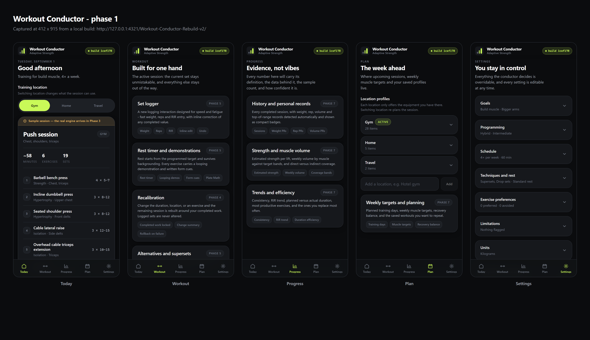

# Project status

> Live, phone-readable status for Workout Conductor. Updated at least once per
> phase.

|                            |                                                                                                                                                                                  |
| -------------------------- | -------------------------------------------------------------------------------------------------------------------------------------------------------------------------------- |
| **Repository**             | https://github.com/Bill6006/Workout-Conductor-Rebuild-v2                                                                                                                         |
| **Live app**               | https://bill6006.github.io/Workout-Conductor-Rebuild-v2/                                                                                                                         |
| **Current phase**          | Phase 1 — Product Foundation and First Useful Live Preview                                                                                                                       |
| **Phase state**            | 🟡 YELLOW — awaiting Android review                                                                                                                                              |
| **Current branch**         | `main`                                                                                                                                                                           |
| **Latest completed phase** | Phase 0 — approved GREEN                                                                                                                                                         |
| **Work in progress**       | Phase 1 review gate                                                                                                                                                              |
| **Latest commit**          | [commit history](https://github.com/Bill6006/Workout-Conductor-Rebuild-v2/commits/main) — the exact deployed build is shown in the app header and in Settings → About this build |
| **Latest deployment**      | ✅ live — [Actions](https://github.com/Bill6006/Workout-Conductor-Rebuild-v2/actions)                                                                                            |
| **Last updated**           | 2026-09-01                                                                                                                                                                       |

---

## Quick links

- [Live app](https://bill6006.github.io/Workout-Conductor-Rebuild-v2/)
- [Commits](https://github.com/Bill6006/Workout-Conductor-Rebuild-v2/commits/main)
- [Actions](https://github.com/Bill6006/Workout-Conductor-Rebuild-v2/actions)
- [Master execution issue](https://github.com/Bill6006/Workout-Conductor-Rebuild-v2/issues/1)
- [Milestone: Workout Conductor v1](https://github.com/Bill6006/Workout-Conductor-Rebuild-v2/milestone/1)
- [Phase 1 report](docs/reports/phase-1.md) · [Phase 0 report](docs/reports/phase-0.md)
- [Architecture](docs/architecture.md)
- [Privacy rules](docs/privacy-rules.md)

---

## Try it on your phone

1. Open the live link. A first visit starts **setup** — eight short steps.
2. Finish setup. You land on **Today** with a session preview built from your
   answers.
3. Tap **Home** or **Travel** under Training location. The session rebuilds
   around the equipment saved for that place.
4. Open **Plan** and expand a location to edit its equipment, or add a new one.
5. Open **Settings** and change anything. It saves immediately.
6. **Reload the page.** Everything is exactly where you left it.
7. Settings → Backup and restore → **Export backup** downloads your setup as
   JSON.

---

## Test totals

| Suite                                          | Tests   | Result      |
| ---------------------------------------------- | ------- | ----------- |
| Unit (Vitest)                                  | 105     | ✅ pass     |
| Browser + mobile (Playwright, 412px and 360px) | 40      | ✅ pass     |
| **Total**                                      | **145** | **✅ pass** |

Also green: ESLint, Prettier, TypeScript (`strict`, `noUncheckedIndexedAccess`),
privacy scan, build verification, tracked-source check.

The full pipeline runs on every push to `main` and the deploy step only runs if
all of it passes.

Bundle: 305 KB uncompressed, 92 KB gzipped.

---

## What Phase 1 delivered

- Step-by-step onboarding: goals, experience, schedule, equipment, techniques,
  limitations, units — all editable later
- Profile model with Zod validation on every read and write
- IndexedDB for durable data, localStorage for small settings only
- Verified saves: write → read back → compare before reporting success
- Honest failure: a banner when storage is blocked, rather than silent data loss
- Recovery of a damaged stored profile, field by field
- Today dashboard with a clearly-labelled synthetic session preview
- Location switching that visibly re-plans the preview
- Plan screen owning location and equipment profiles
- Settings with every field editable, in collapsible sections
- Backup export and import, with import previewed and confirmed before it applies

---

## Screenshots

Captured from the built application, not mockups.

**All five screens (412 × 915)**

| Screen   | 412 px                                                        |
| -------- | ------------------------------------------------------------- |
| Today    | [today-412.png](docs/screenshots/phase-1/today-412.png)       |
| Workout  | [workout-412.png](docs/screenshots/phase-1/workout-412.png)   |
| Progress | [progress-412.png](docs/screenshots/phase-1/progress-412.png) |
| Plan     | [plan-412.png](docs/screenshots/phase-1/plan-412.png)         |
| Settings | [settings-412.png](docs/screenshots/phase-1/settings-412.png) |

Setup: [welcome](docs/screenshots/phase-1/onboarding-welcome-412.png) ·
[goals step](docs/screenshots/phase-1/onboarding-goals-412.png)

Also: [narrowest phone, 360 px](docs/screenshots/phase-1/today-360.png) ·
[full-length Today](docs/screenshots/phase-1/today-412-full.png) ·
[desktop](docs/screenshots/phase-1/today-desktop.png)

---

## Known limitations

These are Phase 1 scope boundaries, not defects.

- **The session on Today is synthetic.** It reads your real profile and filters
  by real equipment, but models no volume, recovery, conflicts or progression.
  It carries an amber "Sample session" banner everywhere it appears. The real
  engine is Phase 3.
- **No duration dropdown yet.** It is a Phase 3 deliverable and will be the only
  workout-length system. Settings exposes a _default_ session length, which is a
  different setting.
- **No workout logging.** Start workout is disabled. Phase 5.
- **Preferred and disliked exercises are free text** until the Phase 2 catalog
  gives them real exercise ids.
- **No workout history.** The IndexedDB store and the backup slot exist, but
  nothing writes to them until Phase 5.
- **Backup import has no rollback yet.** It is previewed and confirmed before it
  applies; rollback is Phase 8.
- **A returning visitor can see the previous build for up to 10 minutes after a
  deploy.** GitHub Pages serves `sw.js` with `Cache-Control: max-age=600`, so
  the browser's update check can read a cached worker for that long. It is
  bounded and self-healing, and opening the link fresh always gets the current
  build. Registering with `updateViaCache: 'none'` is the fix; it belongs with
  the service-worker update safety work in Phase 8.
  Check Settings → About this build for the build you are actually running.
- **Header build marker omits the phase below 416 px** so the wordmark fits. The
  phase is shown in full in Settings → About this build.

---

## Next concrete action

Await the Android review decision on Phase 1:

- `GREEN - NEXT PHASE` → begin Phase 2 (exercise catalog, muscle and movement
  models, conflict validation, alternative-ranking foundation, media manifest
  and licensing register)
- `YELLOW - FIX: <issue>` → fix in place, redeploy, return to this gate
- `RED - STOP` → preserve the current deployment and report

Phase 1 cannot be marked GREEN from inside the project.
