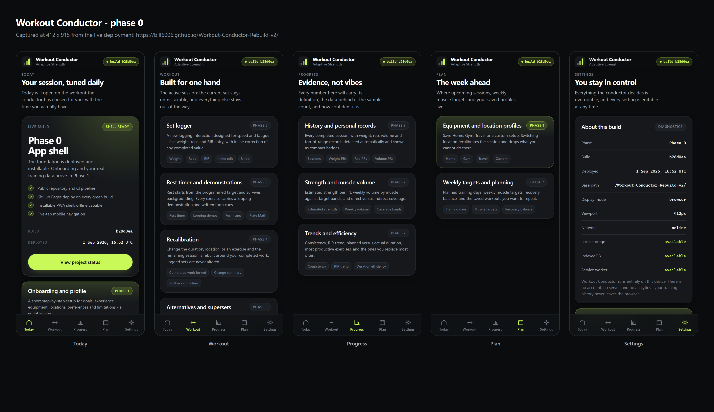

# Project status

> Live, phone-readable status for Workout Conductor. Updated at least once per
> phase.

|                            |                                                                                                                                                                                  |
| -------------------------- | -------------------------------------------------------------------------------------------------------------------------------------------------------------------------------- |
| **Repository**             | https://github.com/Bill6006/Workout-Conductor-Rebuild-v2                                                                                                                         |
| **Live app**               | https://bill6006.github.io/Workout-Conductor-Rebuild-v2/                                                                                                                         |
| **Current phase**          | Phase 0 — Repository, Live Pages, and Scaffold                                                                                                                                   |
| **Phase state**            | 🟡 YELLOW — awaiting Android review                                                                                                                                              |
| **Current branch**         | `main`                                                                                                                                                                           |
| **Latest completed phase** | None (Phase 0 is the first)                                                                                                                                                      |
| **Work in progress**       | Phase 0 review gate                                                                                                                                                              |
| **Latest commit**          | [commit history](https://github.com/Bill6006/Workout-Conductor-Rebuild-v2/commits/main) — the exact deployed build is shown in the app header and in Settings → About this build |
| **Latest deployment**      | ✅ live — [Actions](https://github.com/Bill6006/Workout-Conductor-Rebuild-v2/actions)                                                                                            |
| **Last updated**           | 2026-09-01                                                                                                                                                                       |

---

## Quick links

- [Live app](https://bill6006.github.io/Workout-Conductor-Rebuild-v2/)
- [Commits](https://github.com/Bill6006/Workout-Conductor-Rebuild-v2/commits/main)
- [Actions](https://github.com/Bill6006/Workout-Conductor-Rebuild-v2/actions)
- [Master execution issue](https://github.com/Bill6006/Workout-Conductor-Rebuild-v2/issues/1)
- [Milestone: Workout Conductor v1](https://github.com/Bill6006/Workout-Conductor-Rebuild-v2/milestone/1)
- [Phase 0 report](docs/reports/phase-0.md)
- [Architecture](docs/architecture.md)
- [Privacy rules](docs/privacy-rules.md)

---

## Test totals

| Suite                                          | Tests  | Result      |
| ---------------------------------------------- | ------ | ----------- |
| Unit (Vitest)                                  | 30     | ✅ pass     |
| Browser + mobile (Playwright, 412px and 360px) | 22     | ✅ pass     |
| **Total**                                      | **52** | **✅ pass** |

Also green: ESLint, Prettier, TypeScript (`strict`, `noUncheckedIndexedAccess`),
privacy scan, build verification, tracked-source check.

The full pipeline runs on every push to `main` and the deploy step only runs if
all of it passes.

Bundle: 177 KB uncompressed, 59 KB gzipped.

---

## What Phase 0 delivered

- Public repository with MIT licence and privacy rules
- CI on branches; verified deploy to GitHub Pages on every push to `main`
- Vite + React + TypeScript scaffold, strict mode
- Installable PWA shell with an original generated icon set
- Safe "New version available" prompt that never force-reloads
- Polished dark mobile shell with the five-tab bottom navigation
- Visible build marker (phase + commit) in the header
- Runtime diagnostics panel in Settings
- Privacy scanner, verified against planted samples
- Build verifier for base path, manifest, icons, service worker, build marker
- Tracked-source check, so an ignore rule cannot silently drop source again
- Real Android-sized screenshots, captured from the live deployment

---

## Screenshots

Captured from the **live deployment**, not from a local build and not mockups.

**All five screens (412 × 915)**

| Screen   | 412 px                                                        |
| -------- | ------------------------------------------------------------- |
| Today    | [today-412.png](docs/screenshots/phase-0/today-412.png)       |
| Workout  | [workout-412.png](docs/screenshots/phase-0/workout-412.png)   |
| Progress | [progress-412.png](docs/screenshots/phase-0/progress-412.png) |
| Plan     | [plan-412.png](docs/screenshots/phase-0/plan-412.png)         |
| Settings | [settings-412.png](docs/screenshots/phase-0/settings-412.png) |

Also: [narrowest phone, 360 px](docs/screenshots/phase-0/today-360.png) ·
[full-length Today](docs/screenshots/phase-0/today-412-full.png) ·
[desktop](docs/screenshots/phase-0/today-desktop.png)

---

## Known limitations

These are Phase 0 scope boundaries, not defects.

- **No workout engine yet.** Today shows build status and a roadmap, not a
  session. Generation arrives in Phase 3.
- **No onboarding, profile or settings forms.** Phase 1.
- **No persistence.** IndexedDB and localStorage are probed for availability but
  nothing is stored yet. Phase 1.
- **No exercise catalog or demonstration media.** Phases 2 and 5.
- **Duration dropdown not present.** It is a Phase 3 deliverable and will be the
  only workout-length control (15 / 30 / 45 / Default time).
- **Header build marker omits the phase below 416 px** so the wordmark fits. The
  phase is shown in full on the Today hero and in Settings diagnostics.
- **Playwright covers 412 px and 360 px.** The full 375/430 px and
  115/130 percent zoom matrix lands with the interactive UI in Phase 5.

---

## Next concrete action

Await the Android review decision on Phase 0:

- `GREEN - NEXT PHASE` → begin Phase 1 (onboarding, profile, settings,
  persistence foundation, Today dashboard, synthetic demo workout preview)
- `YELLOW - FIX: <issue>` → fix in place, redeploy, return to this gate
- `RED - STOP` → preserve the current deployment and report

Phase 0 cannot be marked GREEN from inside the project.
